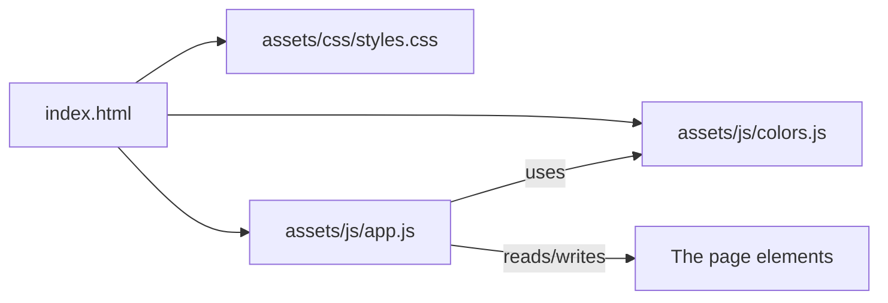
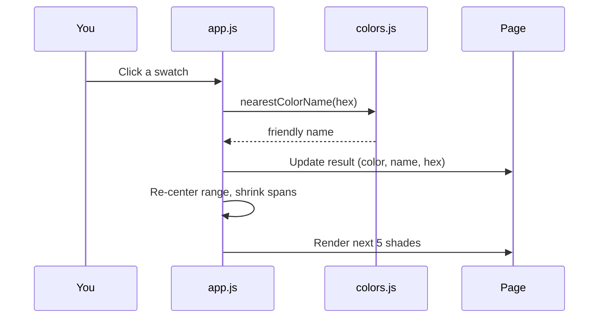

# Architecture & Decisions

This document records the *why* behind how Color Quest is built. Each entry is a
small "Architecture Decision Record" (ADR): the decision, the reasons, and the
trade-offs we accepted.

## High-level shape

- `index.html` defines the structure (what's on the page).
- `styles.css` defines the look (no logic).
- `colors.js` is pure color math + data (no page access).
- `app.js` is the only file that touches the page and ties it all together.

This separation means each file has one job, which is easier to read and learn
from.

## ADR 1 — Static site, no framework, no build step

**Decision:** Use plain HTML, CSS, and vanilla JavaScript. No React/Vue, no
bundler, no `npm`.

**Why:**
- GitHub Pages serves static files directly; with no build step there is nothing
  that can break between "what we wrote" and "what's online."
- Fewer concepts to learn for a first project.
- Instant load, works offline once opened.

**Trade-off:** For a much larger app, a framework would help organize code. For
this size, vanilla JS is simpler and totally sufficient.

## ADR 2 — Do color math in HSL

**Decision:** Represent and manipulate colors in HSL (Hue, Saturation,
Lightness), converting to hex only for display.

**Why:** "Show me shades of this color" maps directly to "keep the hue, change
the lightness." That is awkward in RGB but natural in HSL.

**Trade-off:** We must convert HSL -> RGB -> hex for the browser. That code
lives in `colors.js` and is written once.

## ADR 3 — Progressive narrowing for Explore

**Decision:** Keep a "search range" (a center color plus how wide we vary hue,
saturation, and lightness). Round 1 shows 5 evenly spaced hues. Each pick
re-centers on the chosen color and multiplies the ranges by ~0.55 so the next 5
options are closer together.

**Why:** This converges quickly (each round roughly halves the spread) and
matches the mental model of "zooming in" on the perfect shade.

**Trade-off:** It is a guided funnel, not a full color wheel. That is the
intended, friendly experience.

See `buildVariations()` in [`../assets/js/app.js`](../assets/js/app.js).

## ADR 4 — Naming any color with a curated list

**Decision:** Ship a curated set of common CSS color names in `colors.js`. To
label an arbitrary color we find the *nearest* named color by straight-line
distance in RGB (`nearestColorName`).

**Why:** Gives every color a friendly label and powers search-by-name, without a
large external database.

**Trade-off:** Names are approximate (we say "shade of teal" when it is close but
not exact). Good enough and honest about it.

## ADR 5 — Palette kept in memory only (for v1)

**Decision:** The saved palette lives in a JavaScript array in memory. Refreshing
the page clears it.

**Why:** Keeps v1 tiny and avoids extra concepts on day one.

**Future:** Persist with `localStorage` so favorites survive a refresh (a small,
well-scoped next step).

## Data flow when you pick a color

