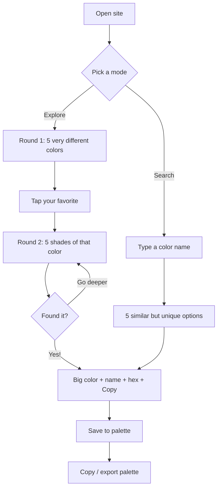

# Color Picker App — Plan

A static website that helps you discover the perfect color two ways: a guided
"pick one of five, then go deeper" flow, and a search-by-name flow. Built with
plain HTML/CSS/JavaScript so it runs for free on GitHub Pages with zero build
step. Designed so a first-time vibe-coder can read the docs and understand every
decision.

## Core concept (what we're building)



## Tech & hosting decisions

- Plain `HTML` + `CSS` + vanilla `JS`. No framework, no bundler, no `npm`.
  Reason: fastest path to a working app, and GitHub Pages serves static files
  directly with no build.
- All color math done in `HSL` (hue/saturation/lightness) because narrowing
  "shades" is intuitive in that space.
- Deploy by pushing to `main` and enabling GitHub Pages
  (Settings -> Pages -> Deploy from branch -> `main` / root). The live URL is
  `https://<user>.github.io/<repo>/`.

## Folder structure

```text
color-picker/
├── index.html            # entry point — MUST live at the repo root for Pages
├── .nojekyll             # tells GitHub Pages to skip Jekyll and serve files as-is
├── README.md             # overview + how to run and deploy
├── assets/
│   ├── css/
│   │   └── styles.css
│   └── js/
│       ├── colors.js     # color math + named-color data
│       └── app.js        # app logic + UI wiring
└── docs/
    ├── PLAN.md           # this document (the first commit)
    ├── ARCHITECTURE.md   # why we made each decision
    ├── LEARNING.md       # plain-language concept explanations
    └── BUILD_PLAN.md     # step-by-step execution checklist
```

## How the logic works

- Explore engine (progressive narrowing): keep a "search range" of
  hue/saturation/lightness. Round 1 shows 5 evenly-spaced hues across the whole
  wheel (truly different colors). When one is tapped, the range tightens around
  it and the next round shows 5 closer variations/shades. A "Found my color!"
  button finalizes at any round.
- Search engine: type a name (e.g. "teal") or a hex. We match it against the
  named-color list, then generate 5 nearby-but-distinct variations by nudging
  lightness/saturation.
- Result + palette: the chosen color shows big with its friendly name + hex and
  a Copy button. "Save to palette" adds it to a strip at the bottom; the whole
  palette can be copied/exported as a list of hex codes.

## Out of scope (for the 15-minute v1)

- No accounts, no backend, no saving between visits (can add `localStorage`
  later).
- Named-color list will be a curated set (the standard CSS color names) rather
  than an exhaustive database.

## After it works

- Quick local check by opening `index.html` in the browser, then push to GitHub
  and enable Pages.
